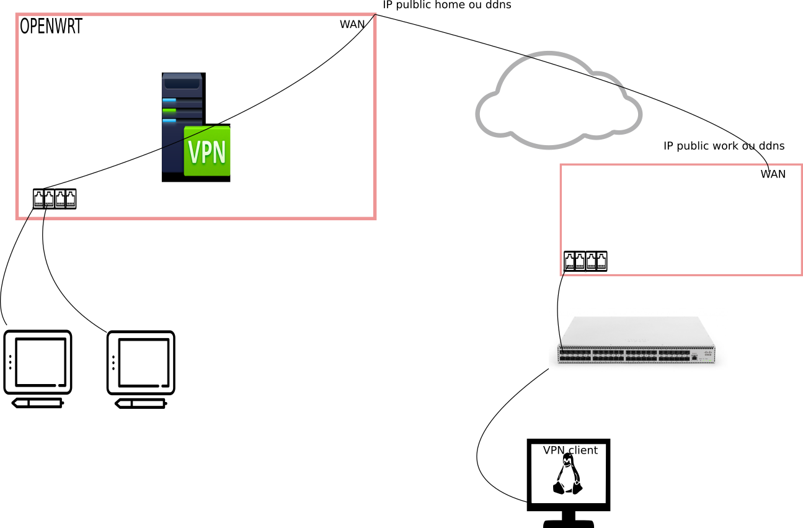

# Tplink Archer C7 V2.0 (V2.0 c'est marqué sur l'etiquette de la boite)


metre dans /etc/profile:   
export PS1='\[\033[35;1m\]\u\[\033[0m\]@\[\033[31;1m\]\h \[\033[32;1m\]$PWD\[\033[0m\] [\[\033[35m\]\#\[\033[0m\]]\[\033[31m\]\$\[\033[0m\] '
c'est plus jolie.

switch port

- 0  eth1
- 1  wan
- 2  lan1
- 3  lan2
- 4  lan3
- 5  lan4 
- 6  eth0

le port wan (je pense que c'est le connecteur rj45 bleu). Il est connecté à eth0

https://wiki.openwrt.org/doc/howto/secure.access


Dans la configuration du routeur a aucun moment je n'ai besoin de donner le ipv4 gateway adresse ni l'adresse du dns server. Je ne comprends pas pourquoi.

# interet du vpn:
Guest network access can easily be granted because you do not need to care about the things your guests are using your Internet for. 

https://blog.ipredator.se/howto/openwrt/configuring-openvpn-on-openwrt.html

Cela veut dire qu'il faudra payer un abonnement à un server VPN extérieur.


# pour connaitre les paquets disponibles 
`opkg search openvpn`

# pour voir les log :
En console ssh:
`logread -f` 
C'est bien mais on ne peut plus utiliser la console. Donc c'est bien pour faire des manipulations dans le webGUI.

Dans le web GUI : Status / System Log  
Mais cela n'est pas dynamique il faut rafraichir.  


# Config du serveur VPN :

https://wiki.openwrt.org/doc/howto/vpn.openvpn  

Afficher les logs: `Status /system log.`

# Création des clefs
Le fichier de conf de easy-rsa est dans /etc/easy-rsa/vars.
./clean-all pour tout effacer

Seuls les .key files doivent etre gardé confidentiel.
.crt et .csr peuvent etre transférer par une voie insecure (comme les mails)
On ne doit jamais devoir copier un .key d'un computer à un autre.

-
- 1 Build own root certificat authority / key
   - ./build-ca
   - CA : certificat authority.
   - crée ca.crt et ca.key dans le KEY_DIR definit dans var.
- 2 Buid intermediate certificat authority / key. Optionel
  - ./Build-inter inter
- 3 Build a diffie-helmann parameters necessaire pour la partie server terminale d'une connection SSL/TLS
  - ./build-dh. Au deuxieme essais cette commande a pris un temps fou. Je n'ai pas pu en voir la fin.
ca n'a pas marché avec les commandes ci dessus.


Mais avec :
  
- pkitool --initca                      ## equivalent to the 'build-ca' script
- pkitool --server my-server            ## equivalent to the 'build-key-server' script
- pkitool          my-client            ## equivalent to the 'build-key' script (*not build-key-pkcs12)
- openssl dhparam -out dh2048.pem 2048  ## equivalent to the 'build-dh' script


On cherche s'il y a une interface tun avec ifconfig -a
On regarde la table de routage avec netsat -nr. On doit avoir et c'est essentiel une route vers le serveur VPN (xxx.xxx.XXX.XXX), une route 
On fait un traceroute pour voir si on va vers le server vpn.

# Quand est ce qu'on donne l'adresse du serveur vpn?
Dans le fichier de configuration du client /etc/config/openvpn : 
- option remote SERVER_IP_ADRESS 1194  
- option remote 'pw.openvpn.ipredator.se 1194'


YOu will need to open port 1194 (TCP) to be forwarding through the firewall to your OpenVPN server. Cela veut dire qu'il faut faire quoi?

# Comment obtenir l'adresse IP du serveur openVPN?
You can easily find out your OpenVPN server IP address. The syntax is as follows to get tun0 ip address on Unix or Linux:
`ifconfig tun0` sur le device qui fait tourner le serveur

Or use Linux specific command:
`ip -a show tun0`

# Comment obtenir l'adresse public
dig TXT +short o-o.myaddr.l.google.com @ns1.google.com

# Comment voir si tout c'est bien passé:
Afficher les log : `logread -f` en console ssh. Mais on ne peut plus faire de commande en ssh. Il faut une deuxieme console avec un ssh. 
~~~
/etc/init.d/openvpn enable
/etc/init.d/openvpn start
~~~
- If everything went fine, the last log line from OpenVPN should contain Initialization Sequence Completed. There are some warnings and errors ... ignore them.

- `ps | grep openvpn`

- s'assurer que le lien est up avec `ifconfig tun0`, `ifconfig | grep tun` `ifconfig -a`
	- on doit avoir une ligne du genre : ` inet addr:10.8.0.6  P-t-P:10.8.0.5  Mask:255.255.255.255`

- s'assurer que cela fonctionne : `ping 10.8.0.1 -c 2`

- On regarde la table de routage avec netsat -nr. On doit avoir et c'est essentiel une route vers le serveur VPN (xxx.xxx.XXX.XXX)
 
- On fait un traceroute  10.8.0.1 pour voir si on va vers le server vpn. (?)


# comment tester le server openvpn depuis le LAN
- If you don't mind reconfiguring your network, you could also unplug the modem, plug a computer in its place, set the router WAN to a static IP (192.168.64.1) and the computer on 192.168.64.2, and try connecting to the VPN using the .1 IP.
- En utilisant une connection 3G
- En changeant l'option remote pour qu'elle pointe vers l'adresse IP privée du serveur openvpn.

~~~client
dev tap
proto udp
# remote yourddns.dyndns.org 5712
remote 192.168.1.160 5712
~~~~
Si votre openvpn est votre routeur ce sera l'adresse du routeur 192.168.1.1.

# configuration du client

## Quels sont les fichiers à sauvegarder 
- ca.crt
- my.client.crt
- my.client.crs
- my.client.key

###  A sauvegarder dans : /etc/openvp. 


##  Création du fichier de configuration du client:

~~~
dev tun
proto udp

log openvpn.log
verb 3

ca /etc/openvpn/ca.crt
cert /etc/openvpn/my-client.crt
key /etc/openvpn/my-client.key

client
remote-cert-tls server
remote SERVER_IP_ADDRESS 1194
~~~
`SERVER_IP_ADDRESS` on mettra un dyndns fqdm et une regle de NAT sur le firewall pour rediriger vers le serveur.  
Et donc qu'elle est l'adresse du serveur?

openvpn client.conf


## depuis le client
`ifconfig` à la recherche d'un tun  
`ping SERVER_IP_ADDRESS`  
`ping 10.8.0.1` <-- ip address que l'on trouve en faisant un ifconfig tun0  
`traceroute 10.8.0.1` # je ne sais d'ou sort cette IP. Elle n'existe nulle part ailleurs dans les fichiers de config.   
Si on fait un `traceroute 8.8.8.8` sur une adresse IP public on devrait voir que le traffic utilise l'adress gateway par défaut du client.   

Il n'y a pas de tun dans le openwrt qui heberge le vpn server.

## depuis openwrt qui héberge le vpn server.
- `ifconfig tun0`

# Port forwarding

Je ne sais pas du tout s'il faut faire du port forwarding pour openvpn.

On crée une *forward rule*. Je comprends les choses comme cela. Les paquets ip envoyés depuis le remote client arrive sur l'interface WAN du routeur du serveur openvpn car c'est ce que j'ai mis dans le fichier de configuration du serveur. C'est paquet doivent etre redirigé vers le serveur openrp.  
##  Port forwarding 
permet de forwarder le traffic externe vers un hote interne ou un service.  
fichier de configuration : /etc/config/firewall


# Dans le cas d'odoo:
- *Source zone* : wan
- *Protocol* : TCP +UDP
- *external port* 8069
- *internal ip address*: adress ip du serveur dans le LAN
- *internal* port (optional): 8069
Et dans l'onglet Advanced setting
- *Redirection type*: DNAT
- *Destination zone*: LAN
- *intended destination address* : any
- *Source MAC address* : any
- *Source port* : 0-65536 
- *Enable nat loopback*

~~~
config 'redirect'
	option '_name' 'Odoo'
	option 'src' 'wan'
	option 'proto' 'tcpudp'
	option 'src_dport' '8069'
	option 'dest_ip' '192.168.1.110'
	option 'target' 'DNAT'
	option 'dest' 'lan'
	option 'dest_port' '8069'
~~~
~~~
firewall.@redirect[1]._name=Odoo
firewall.@redirect[1].src=wan
firewall.@redirect[1].proto=tcpudp
firewall.@redirect[1].src_dport=8069
firewall.@redirect[1].dest_ip=192.168.1.110
firewall.@redirect[1].target=DNAT
firewall.@redirect[1].dest=lan
firewall.@redirect[1].dest_port=8069
firewall.@redirect[2]=redirect
~~~

# server configuration file
- crée un VPN en utilisant une interface virtuelle TUN pour le routage. 
- ecoute sur le port UDP 1194 pour les connection client.
- distribue des adresses virtuelles aux clients qui se connectent en utilisant le subnet 10.8.0.0/24

# Comment inclure plusieurs machines soit sur le subnet du client soit sur le subnet du serveur?

Il peut etre souhaitable que les clients puisse joindre plusieurs machines dans le subnet du serveur, plutot que seulement le server.
Le LAN du serveur a comme subnet 10.66.0.0/24  
Le pool IP Address du VPN est 10.8.0.0/24 comme indiqué dans la directive *server* du fichier de conf  

-1 il faut informer le client que le subnet 10.66.0.0/24 est accessible par le VPN. Cela se fait par la directive dans le server.conf coté server donc:
	- push "route 10.66.0.0 255.255.255.0"
-2 il faut mettre en place une route sur le server LAN gateway pour router le subnet du client (10.8.0.0/24) vers le serveur openvpn. C'est seulement nécessaire si le server openvpn et le LAN gateway sont sur des machines différantes.   

# Comment inclure de multiples machines dans le subnet du client en utilisant un routed VPN (TUN)
Si le client VPN est une gateway pour un LAN local et que vous voulez que les machines sur le LAN du client puisse router au travers du VPN.  
subnet IP client LAN : 192.168.4.0/24  
 
# configuration du serveur sur une machine qui n'est pas le routeur
fichier /etc/openvpn/server.conf
- directive `local`: to make it listen to an IP adress. C'est l'adress IP vers qui est forwardé UDP port 1194 par le firewall.
- Pour que les remote clients quand ils se connectent sur le server, puissent atteindre autre choses que les que le serveur lui meme il faut activer le ip forwarding avec
- `echo 1 > /proc/sys/net/ipv4/ip_forward`
- ou editer /etc/systcl.conf : `net.ipv4.ip_forward = 1`

On doit pouvoir pinguer n'importe qu'elle machine sur le LAN du server à partir du client. et pouvoir pinguer le client de n'importe qu'elle machine sur le LAN du server

Depuis le client traceroute 192.168.10.65 (ip address LAN du réseau du serveur)
ping 192.168.10.65

# Comment revoir sa configuration
`uci show openvpn`  
`cat /etc/config/openvpn`  
`cat /var/etc/openvpn-myvpn.conf`  



# /etc/init.d/openvpn stop
- /sbin/route del -net 10.8.0.0 netmask 255.255.255.0
- closing TUN/TAP ifconfig tun0 0.0.0.0
- vpn0 connectivity loss and down.
- interface vpn0 is disable.
- dans le webGUI on ne voit pas grand chose juste network / interface / VPN0 tout est à zero. Et Services myvpn started :no

# /etc/init.d/openvpn start
- odhcpd[933]: DHCPV6 REBIND IA_NA from 000100011fcb37e7b827eb8af1d3 on br-lan: ok 
- odhcpd[933]: DHCPV6 CONFIRM IA_NA from 00042a085bb2bdc05a56c90932812284df12 on br-lan: 
- odhcpd[933]: DHCPV6 SOLICIT IA_NA from 00042a085bb2bdc05a56c90932812284df12 on br-lan: ok
- dnsmasq[1403]: read /etc/hosts - 1 addresses
- dnsmasq[1403]: read /tmp/hosts/odhcpd - 0 addresses
- dnsmasq[1403]: read /tmp/hosts/dhcp - 1 addresses
- dnsmasq-dhcp[1403]: read /etc/ethers - 0 addresses
- odhcpd[933]: DHCPV6 REQUEST IA_NA from 00042a085bb2bdc05a56c90932812284df12 on br-lan: ok 8 
- dnsmasq[1403]: read /etc/hosts - 1 addresses
- dnsmasq[1403]: read /tmp/hosts/odhcpd - 1 addresses
- dnsmasq[1403]: read /tmp/hosts/dhcp - 1 addresses
- dnsmasq-dhcp[1403]: read /etc/ethers - 0 addresses
- openvpn(myvpn)[2968]: OpenVPN 2.3.6 mips-openwrt-linux-gnu [SSL (OpenSSL)] [LZO] [EPOLL] [MH] [IPv6] built on Jul 25 2015
- openvpn(myvpn)[2968]: library versions: OpenSSL 1.0.2g  1 Mar 2016, LZO 2.08
- openvpn(myvpn)[2968]: Diffie-Hellman initialized with 2048 bit key
- openvpn(myvpn)[2968]: Socket Buffers: R=[163840->131072] S=[163840->131072]
- netifd: Interface 'vpn0' is enabled

# Mise en route du client openvpn.
 - avant la mise en route : `ifconfig` ne donne pas d'interface tun
 - le fichier de config
 
 ```
 ##############################################
# Sample client-side OpenVPN 2.0 config file #
# for connecting to multi-client server.     #
#                                            #
# This configuration can be used by multiple #
# clients, however each client should have   #
# its own cert and key files.                #
#                                            #
# On Windows, you might want to rename this  #
# file so it has a .ovpn extension           #
##############################################

# Specify that we are a client and that we
# will be pulling certain config file directives
# from the server.
client

# Use the same setting as you are using on
# the server.
# On most systems, the VPN will not function
# unless you partially or fully disable
# the firewall for the TUN/TAP interface.
;dev tap
dev tun

# Windows needs the TAP-Win32 adapter name
# from the Network Connections panel
# if you have more than one.  On XP SP2,
# you may need to disable the firewall
# for the TAP adapter.
;dev-node MyTap

# Are we connecting to a TCP or
# UDP server?  Use the same setting as
# on the server.
;proto tcp
proto udp

# The hostname/IP and port of the server.
# You can have multiple remote entries
# to load balance between the servers.
remote 103.17.45.190 1194
;remote my-server-2 1194

# Choose a random host from the remote
# list for load-balancing.  Otherwise
# try hosts in the order specified.
;remote-random

# Keep trying indefinitely to resolve the
# host name of the OpenVPN server.  Very useful
# on machines which are not permanently connected
# to the internet such as laptops.
resolv-retry infinite

# Most clients don't need to bind to
# a specific local port number.
nobind

# Downgrade privileges after initialization (non-Windows only)
;user nobody
;group nogroup

# Try to preserve some state across restarts.
persist-key
persist-tun

# If you are connecting through an
# HTTP proxy to reach the actual OpenVPN
# server, put the proxy server/IP and
# port number here.  See the man page
# if your proxy server requires
# authentication.
;http-proxy-retry # retry on connection failures
;http-proxy [proxy server] [proxy port #]

# Wireless networks often produce a lot
# of duplicate packets.  Set this flag
# to silence duplicate packet warnings.
;mute-replay-warnings

# SSL/TLS parms.
# See the server config file for more
# description.  It's best to use
# a separate .crt/.key file pair
# for each client.  A single ca
# file can be used for all clients.
ca ca.crt
cert my.client.crt
key my.client.key

# Verify server certificate by checking
# that the certicate has the nsCertType
# field set to "server".  This is an
# important precaution to protect against
# a potential attack discussed here:
#  http://openvpn.net/howto.html#mitm
#
# To use this feature, you will need to generate
# your server certificates with the nsCertType
# field set to "server".  The build-key-server
# script in the easy-rsa folder will do this.
ns-cert-type server

# If a tls-auth key is used on the server
# then every client must also have the key.
;tls-auth ta.key 1

# Select a cryptographic cipher.
# If the cipher option is used on the server
# then you must also specify it here.
;cipher x

# Enable compression on the VPN link.
# Don't enable this unless it is also
# enabled in the server config file.
;comp-lzo

# Set log file verbosity.
verb 3

# Silence repeating messages
;mute 20
```

- sous root (a tester sur un user) : `cd /etc/openvpn``openvpn client.conf`
- s'affiche : 
```
on Sep  4 09:57:26 2017 OpenVPN 2.3.4 x86_64-pc-linux-gnu [SSL (OpenSSL)] [LZO] [EPOLL] [PKCS11] [MH] [IPv6] built on Nov 12 2015
Mon Sep  4 09:57:26 2017 library versions: OpenSSL 1.0.1t  3 May 2016, LZO 2.08
Mon Sep  4 09:57:26 2017 WARNING: file 'my.client.key' is group or others accessible
Mon Sep  4 09:57:26 2017 Socket Buffers: R=[212992->131072] S=[212992->131072]
Mon Sep  4 09:57:26 2017 UDPv4 link local: [undef]
Mon Sep  4 09:57:26 2017 UDPv4 link remote: [AF_INET]103.17.45.190:1194
Mon Sep  4 09:57:26 2017 TLS: Initial packet from [AF_INET]103.17.45.190:1194, sid=66d68e07 4b481f65
Mon Sep  4 09:57:26 2017 VERIFY OK: depth=1, C=US, ST=CA, L=SanFrancisco, O=Fort-Funston, OU=MyOrganizationalUnit, CN=Fort-Funston CA, name=EasyRSA, emailAddress=me@myhost.mydomain
Mon Sep  4 09:57:26 2017 VERIFY OK: nsCertType=SERVER
Mon Sep  4 09:57:26 2017 VERIFY OK: depth=0, C=US, ST=CA, L=SanFrancisco, O=Fort-Funston, OU=MyOrganizationalUnit, CN=my.server, name=EasyRSA, emailAddress=me@myhost.mydomain
Mon Sep  4 09:57:27 2017 Data Channel Encrypt: Cipher 'BF-CBC' initialized with 128 bit key
Mon Sep  4 09:57:27 2017 Data Channel Encrypt: Using 160 bit message hash 'SHA1' for HMAC authentication
Mon Sep  4 09:57:27 2017 Data Channel Decrypt: Cipher 'BF-CBC' initialized with 128 bit key
Mon Sep  4 09:57:27 2017 Data Channel Decrypt: Using 160 bit message hash 'SHA1' for HMAC authentication
Mon Sep  4 09:57:27 2017 Control Channel: TLSv1, cipher TLSv1/SSLv3 DHE-RSA-AES256-SHA, 2048 bit RSA
Mon Sep  4 09:57:27 2017 [my.server] Peer Connection Initiated with [AF_INET]103.17.45.190:1194
Mon Sep  4 09:57:29 2017 SENT CONTROL [my.server]: 'PUSH_REQUEST' (status=1)
Mon Sep  4 09:57:30 2017 PUSH: Received control message: 'PUSH_REPLY,route 10.8.0.1,topology net30,ping 10,ping-restart 120,ifconfig 10.8.0.6 10.8.0.5'
Mon Sep  4 09:57:30 2017 OPTIONS IMPORT: timers and/or timeouts modified
Mon Sep  4 09:57:30 2017 OPTIONS IMPORT: --ifconfig/up options modified
Mon Sep  4 09:57:30 2017 OPTIONS IMPORT: route options modified
Mon Sep  4 09:57:30 2017 ROUTE_GATEWAY 192.168.1.1/255.255.255.0 IFACE=eth1 HWADDR=50:e5:49:3e:4b:7e
Mon Sep  4 09:57:30 2017 TUN/TAP device tun0 opened
Mon Sep  4 09:57:30 2017 TUN/TAP TX queue length set to 100
Mon Sep  4 09:57:30 2017 do_ifconfig, tt->ipv6=0, tt->did_ifconfig_ipv6_setup=0
Mon Sep  4 09:57:30 2017 /sbin/ip link set dev tun0 up mtu 1500
Mon Sep  4 09:57:30 2017 /sbin/ip addr add dev tun0 local 10.8.0.6 peer 10.8.0.5
Mon Sep  4 09:57:30 2017 /sbin/ip route add 10.8.0.1/32 via 10.8.0.5
Mon Sep  4 09:57:30 2017 Initialization Sequence Completed
Mon Sep  4 10:02:43 2017 [my.server] Inactivity timeout (--ping-restart), restarting
Mon Sep  4 10:02:43 2017 SIGUSR1[soft,ping-restart] received, process restarting
Mon Sep  4 10:02:43 2017 Restart pause, 2 second(s)
Mon Sep  4 10:02:45 2017 Socket Buffers: R=[212992->131072] S=[212992->131072]
Mon Sep  4 10:02:45 2017 UDPv4 link local: [undef]
Mon Sep  4 10:02:45 2017 UDPv4 link remote: [AF_INET]103.17.45.190:1194
Mon Sep  4 10:02:45 2017 TLS: Initial packet from [AF_INET]103.17.45.190:1194, sid=12d067d5 ad235fd0
Mon Sep  4 10:02:46 2017 VERIFY OK: depth=1, C=US, ST=CA, L=SanFrancisco, O=Fort-Funston, OU=MyOrganizationalUnit, CN=Fort-Funston CA, name=EasyRSA, emailAddress=me@myhost.mydomain
Mon Sep  4 10:02:46 2017 VERIFY OK: nsCertType=SERVER
Mon Sep  4 10:02:46 2017 VERIFY OK: depth=0, C=US, ST=CA, L=SanFrancisco, O=Fort-Funston, OU=MyOrganizationalUnit, CN=my.server, name=EasyRSA, emailAddress=me@myhost.mydomain
Mon Sep  4 10:02:46 2017 Data Channel Encrypt: Cipher 'BF-CBC' initialized with 128 bit key
Mon Sep  4 10:02:46 2017 Data Channel Encrypt: Using 160 bit message hash 'SHA1' for HMAC authentication
Mon Sep  4 10:02:46 2017 Data Channel Decrypt: Cipher 'BF-CBC' initialized with 128 bit key
Mon Sep  4 10:02:46 2017 Data Channel Decrypt: Using 160 bit message hash 'SHA1' for HMAC authentication
Mon Sep  4 10:02:46 2017 Control Channel: TLSv1, cipher TLSv1/SSLv3 DHE-RSA-AES256-SHA, 2048 bit RSA
Mon Sep  4 10:02:46 2017 [my.server] Peer Connection Initiated with [AF_INET]103.17.45.190:1194
Mon Sep  4 10:02:49 2017 SENT CONTROL [my.server]: 'PUSH_REQUEST' (status=1)
Mon Sep  4 10:02:49 2017 PUSH: Received control message: 'PUSH_REPLY,route 10.8.0.1,topology net30,ping 10,ping-restart 120,ifconfig 10.8.0.6 10.8.0.5'
Mon Sep  4 10:02:49 2017 OPTIONS IMPORT: timers and/or timeouts modified
Mon Sep  4 10:02:49 2017 OPTIONS IMPORT: --ifconfig/up options modified
Mon Sep  4 10:02:49 2017 OPTIONS IMPORT: route options modified
Mon Sep  4 10:02:49 2017 Preserving previous TUN/TAP instance: tun0
Mon Sep  4 10:02:49 2017 Initialization Sequence Completed
```
- traceroute 10.8.0.1
```
Je dois voir passer le traffic par la gateway classique.
traceroute to 10.8.0.1 (10.8.0.1), 30 hops max, 60 byte packets
 1  10.8.0.1 (10.8.0.1)  32.545 ms  34.459 ms  36.583 ms
 ```
 
# Comment arréter le client VPN 
 
 killall -SIGINT openvpn  

```
# stop the service    
$ sudo /etc/init.d/openvpn stop

# find the process if for some reason it keeps running
$ lsof -i | grep openvpn

# kill the proccess(s) by its PID
$ kill -9 <PID>

# if necessary restart the service again
$ sudo /etc/init.d/openvpn start
sudo update-rc.d openvpn disable
```
Or edit the config file in /etc/default/openvpn

sudo nano /etc/default/openvpn

And uncomment the line:

#AUTOSTART="none"

So it looks like:

AUTOSTART="none"

Then you'll have to run:

sudo service openvpn start < vpn-name > to manually start the VPN.

sudo service openvpn stop < vpn-name > to manually stop the VPN.

< vpn-name > is the config file name without .conf extension

located in /etc/openvpn and without the < >


# Comment ping les device du LAN du server.
https://serverfault.com/questions/662500/openvpn-access-to-lan-behind-client-and-vice-versa


# Eviter les conflits d'adresse IP
Je change le subnet IP du serveur --> 10.66.0.0/24

- 1 je crée une interface pour ce subnet dans ma machine pour ce subnet.
- 2 je change l'ip subnet dans openwrt. je change juste network / LAN / General Setup / IPv4 address / Save and apply 
- 2 je reboot openwrt
- 3 j'utilise ma nouvelle interface configuration dans ma machine.
- 4 ping dans les deux sens OK
- 5 ssh openwrt ne marche pas
- 6 reboot openwrt
- 7 ssh openwrt marche à nouveau

- 8 uci add_list openvpn.myvpn.push='route 10.66.0.0 255.255.255.0'
- 9 on ne voit pas les changements faits par cette commande dans cat /var/etc/openvpn-myvpn.conf, /etc/config/openvpn/
- 10 uci show openvpn on voit la commande.
- 11 finalement je mets cette option dans le fichier de config /etc/config/openvpn
- 12 je mets d'autres options sur le dhcp notamment.

# ajout d'une new forward rule
- nom OpenVPN
- dans firewall / Traffic Rule
- essayer de l'enlever.


# Comprendre les tables de routage

```
Destination     Gateway         Genmask         Flags Metric Ref    Use Iface
192.168.1.0     *               255.255.255.0   U     1      0        0 eth0
```
Tous les paquets avec une destination 192.168.1.0 à 192.168.1.255 sera envoyé à travers l'interface eth0 sans utiliser de gateway (sauf s'il y a une autre route qui écrase celle là)    

```
Destination     Gateway         Genmask         Flags Metric Ref    Use Iface
default         192.168.1.1     0.0.0.0         UG    0      0        0 eth0
```
Tous les paquets qui ont une destination sans autre route sera envoyé à travers eth0 en utilisant la gateway 192.168.1.1

*Default* ca veut que si il n'existe pas d'autre route alors utilise celle là.  
*Gateway* next hop. 


## ifconfig
```
eth0      Link encap:Ethernet  HWaddr 00:80:C8:F8:4A:51  
          inet addr:192.168.99.35  Bcast:192.168.99.255  Mask:255.255.255.0
```
l'adresse active est donc 192.168.99.35. Ce qui veut dire que tout paquet envoyé par cette ordinateur aura comme adresse source 192.168.99.35. Et tous les paquets recus par cette ordinateur aura comme destination address 192.168.99.35. 

Gateway : 0.0.0.0 veut dire qu'il n'y en a pas. 

## Unicast vs Broadcast
- Unicast
	- HTTP 
	- SMTP 
	- POP3
	- SSH
	- LDAP
- Broadcast. S'adresse à tout le subnet. On peut le calculer avec l'IP address et le mask mais on peut donner une autre adresse. Et cela peut poser des problemes.
	- SMB
	- Samba
	- DHCP
	
Unicast s'oppose à broadcast.
